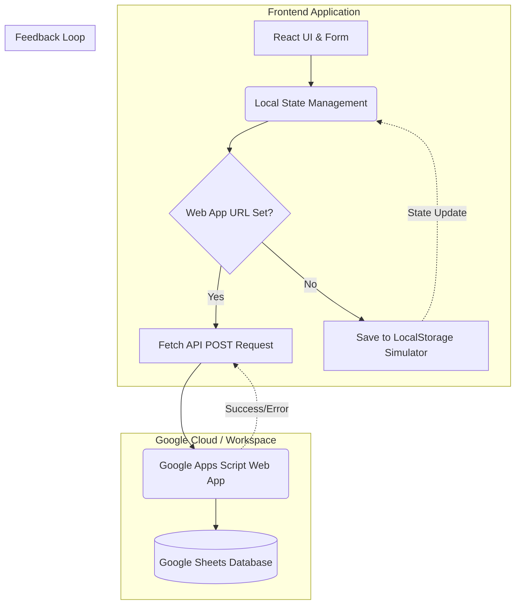

<div align="center">
  

  <h1 align="center">Dynamic Workflow Automation App</h1>

  <p align="center">
    A modern, bilingual web application for seamless workflow management and automated tracking using React, TailwindCSS, and Google Sheets integration.
  </p>
  
  <p align="center">
    <a href="#features">Features</a> •
    <a href="#architecture">Architecture</a> •
    <a href="#tech-stack">Tech Stack</a> •
    <a href="#installation">Installation</a> •
    <a href="#google-apps-script-setup">Google Apps Script Setup</a>
  </p>
</div>

---

## 🌟 Overview

The **Dynamic Workflow Automation App** is a fast, responsive, and beautifully designed productivity tool. It helps users log daily workflows, track tasks across multiple sheets, view real-time statistics, and seamlessly synchronize all this data with Google Sheets via a Google Apps Script Web App. 

With built-in **bilingual support** (English and Bengali) and **dynamic theming** (Light/Dark mode), this app caters to a diverse user base while offering an exceptionally premium and intuitive user experience.

---

## 🚀 Features

- **Google Sheets Synchronization**: Connect the app to a Google Apps Script URL to push and save form entries directly to a Google Sheet online.
- **Multiple Worksheets Support**: Organize your workflows into multiple sheets. You can add, remove, and switch between active sheets on the fly.
- **Bilingual Interface (English & Bengali)**: Instantly switch the entire application interface between English and Bengali using context providers.
- **Dark/Light Theme & Accents**: Fully supported dark mode along with customizable accent colors to personalize your workflow dashboard.
- **Rich Interactive Dashboard**: View daily and all-time work statistics (Total hours, entries, etc.) at a glance on a polished Hero banner.
- **Advanced Form Inputs**: Includes dynamic date pickers, voice input features, and even a signature pad for verifications.
- **Local Simulation**: Don't have an active internet connection or Apps Script URL yet? The app falls back to localStorage, behaving as a seamless local simulator.

---

## 🏗️ Architecture

Below is the architectural flow illustrating how the frontend connects with Google Apps Script to synchronize data:



### Components Breakdown:
1. **React UI**: Captures user input (workflow details, hours, signature).
2. **Contexts**: `ThemeContext` and `LanguageContext` provide application-wide state.
3. **Apps Script Endpoint**: A `doPost` function deployed as a Web App to process incoming JSON payloads and append rows to a specified Google Sheet.

---

## 💻 Tech Stack

- **Framework**: [React 19](https://react.dev/) with [Vite 6](https://vitejs.dev/)
- **Language**: [TypeScript](https://www.typescriptlang.org/)
- **Styling**: [Tailwind CSS v4](https://tailwindcss.com/)
- **Icons**: [Lucide React](https://lucide.dev/)
- **Animations**: [Motion](https://motion.dev/)
- **Backend / Database**: Google Apps Script & Google Sheets

---

## 🛠️ Installation & Local Development

Follow these steps to run the project locally on your machine.

**Prerequisites:** 
- Node.js (v18+ recommended)
- Git

### 1. Clone the repository
```bash
git clone https://github.com/SayhamKayes/Workflow-Automation-App.git
cd dynamic-workflow-app/dynamic-workflow-app
```

### 2. Install dependencies
```bash
npm install
```

### 3. Environment Setup (Optional)
If you have a Google Apps Script URL ready, you can configure it locally:
- Copy the `.env.example` file to `.env.local`
- Set the `VITE_APPS_SCRIPT_URL` variable to your generated Web App URL.

### 4. Start the Development Server
```bash
npm run dev
```
Open your browser and navigate to the local host URL provided in the terminal (usually `http://localhost:3000`).

---

## 🔗 Google Apps Script Setup

To fully utilize the cloud synchronization, you must set up a Google Apps Script to connect with your Google Sheet.

1. Create a new Google Sheet.
2. Go to **Extensions > Apps Script**.
3. Replace the code in the script editor with the `doPost` function that handles JSON payloads. (A template is typically provided in `src/constants/googleScriptCode.ts`).
4. Click **Deploy > New Deployment**.
5. Select **Web app** as the type.
6. Set **Execute as** to *Me*.
7. Set **Who has access** to *Anyone*.
8. Click Deploy, authorize the necessary permissions, and copy the **Web app URL**.
9. Paste this URL into the app's Settings Modal or `.env.local` file.

---

## 📜 License

This project is open-source and available under standard MIT guidelines. Feel free to fork, modify, and improve!
